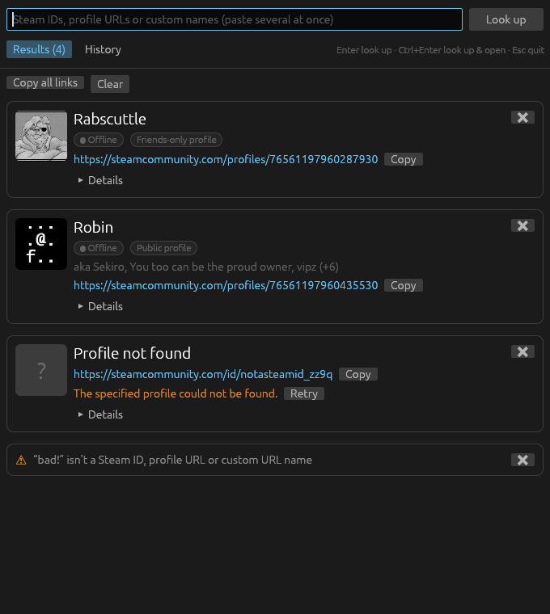

# SteamIDfinder


Paste any Steam ID and get a clickable link to the Steam profile, along with the profile's
current name, avatar and name history. A small native app for Linux and Windows.

> **Unofficial tool.** SteamIDfinder is an independent project. It is not affiliated with,
> endorsed by or connected to Valve Corporation or Steam in any way.



## What it does

- **Understands every common format** and works out which one you pasted:
  - SteamID64: `76561197960287930`
  - SteamID2: `STEAM_0:0:11101`
  - SteamID3: `[U:1:22202]`
  - account IDs: `22202`
  - profile URLs: `steamcommunity.com/profiles/…` and `steamcommunity.com/id/…`
  - bare custom URL names: `gabelogannewell`
- **Batch lookups**: paste a whole list (separated by spaces, commas or new lines) and every
  ID gets its own card.
- **Each card shows**:
  - avatar and current name
  - previous names ("aka …")
  - online / in-game status, VAC and trade bans, profile privacy
  - the profile link (opens in your browser) with a Copy button
  - a Details section with every ID format, each copyable
- **History** of every profile you've looked up, kept between sessions. It's searchable by
  name, previous name or any ID, and it notes when someone changed their name since you last
  looked.
- **No API key needed.** It reads Steam's public community endpoints directly.

Keys: **Enter** looks up, **Ctrl+Enter** looks up and opens the first result,
**Esc** quits.

## Install

### Linux

Download `steamidfinder-<version>-linux-x86_64.tar.gz` from
[Releases](https://github.com/Alelau18/SteamIDfinder/releases), unpack it, and run the
installer:

```sh
tar xzf steamidfinder-*-linux-x86_64.tar.gz
cd steamidfinder-*/
./install.sh            # per-user, into ~/.local (no sudo)
./install.sh --system   # or for everyone, into /usr/local
```

SteamIDfinder then shows up in any app launcher that reads desktop entries: GNOME, KDE,
rofi, fuzzel, wofi, Noctalia, and others. Remove it with `./install.sh --uninstall` (add
`--system` if you installed it that way).

**AppImage:** download `SteamIDfinder-<version>-x86_64.AppImage`, `chmod +x` it, and run it.
It won't appear in launchers unless you use a tool like AppImageLauncher. The tarball is
the better choice if that matters to you.

**Arch Linux:** a `steamidfinder-git` PKGBUILD lives in [`packaging/arch`](packaging/arch).
It isn't on the AUR, so build it yourself:

```sh
cd packaging/arch && makepkg -si
```

### Windows

Download `SteamIDfinder-<version>-windows-x86_64.exe` from
[Releases](https://github.com/Alelau18/SteamIDfinder/releases) and run it. It's a single
portable file with no installer. The exe isn't code-signed, so SmartScreen may warn the first
time: choose **More info → Run anyway**.

### From source

You need a Rust toolchain (stable).

```sh
git clone https://github.com/Alelau18/SteamIDfinder
cd SteamIDfinder
./install.sh            # builds a release binary if needed, then installs it
```

## Command line

```
steamidfinder [ID ...]
```

IDs passed as arguments are looked up as soon as the window opens, which makes it easy to
hook into launchers and scripts.

### Noctalia launcher

[`extras/noctalia/steamidfinder.toml`](extras/noctalia/steamidfinder.toml) adds a
`/steam` command to the [Noctalia](https://github.com/noctalia-dev/noctalia-shell)
launcher. Copy it into `~/.config/noctalia/`, then type
`/steam 76561197960287930 gabelogannewell` and press Enter.

## Where data lives

History and cached avatars are stored in:

- Linux: `~/.local/share/steamidfinder/` (or `$XDG_DATA_HOME/steamidfinder/`)
- Windows: `%APPDATA%\SteamIDfinder\`

The history keeps up to 500 profiles. The app only talks to `steamcommunity.com` and Steam's
avatar CDN.

## Building

```sh
scripts/build.sh            # tests + release binary
scripts/build.sh --dist     # + release tarball in dist/
scripts/build.sh --appimage # + AppImage in dist/ (downloads appimagetool on first use)
```

Windows builds and releases are produced by GitHub Actions: pushing a `v*` tag publishes
the tarball, AppImage and exe to a GitHub Release.

UI screenshots for review can be rendered offscreen (needs a GPU):

```sh
SCREENSHOT_DIR=/tmp/shots cargo test render_screenshots -- --ignored
```

## License

[MIT](LICENSE).

SteamIDfinder is an unofficial, community-made tool. It is not affiliated with, endorsed by or
sponsored by Valve Corporation. Steam and the Steam logo are trademarks of Valve Corporation.
The SteamIDfinder logo is its own design and is not the Steam logo.
